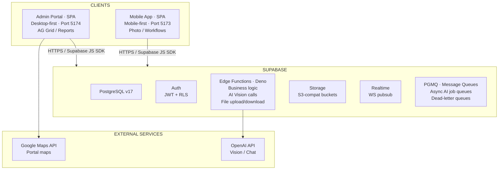

# Platform Architecture

**Audience**: Engineers and technical leads
**Scope**: Domain-agnostic technical reference for a Supabase-powered SaaS platform

This document describes the architecture of a multi-tenant SaaS platform built as an Nx monorepo with two React frontends, a Supabase backend (Postgres, Auth, Storage, Edge Functions, Realtime), and an asynchronous AI analysis pipeline. All examples use generic terminology: "orders", "items", "photos", `<entity>`, `<org>`, "Acme Corp", "Test Co".

---

## 1. System Overview

The platform consists of two user-facing applications backed by a shared Supabase cloud backend.

| Application | Target | Purpose |
|-------------|--------|---------|
| Admin Portal | Desktop (SPA) | Data grids, configuration, reporting, AI chat |
| Mobile App | Mobile-first (SPA/PWA) | Photo workflows, field inspections, offline-capable patterns |

Both apps communicate with Supabase using the official JavaScript SDK. There is no dedicated API server, Express router, or GraphQL schema. Authorization is enforced at the database layer via PostgreSQL Row-Level Security (RLS). Edge functions handle server-side logic that cannot run in the browser (AI calls, file proxies, PDF generation).



### Key architectural properties

- **No API server**: Both apps query Postgres directly via the Supabase SDK. RLS enforces authorization at the data layer, regardless of how queries are constructed.
- **Serverless compute**: Edge functions (Deno) handle server-side operations. No long-running Node.js processes to manage.
- **Async AI**: Photo analysis is fully asynchronous. Users never wait for AI results. Updates arrive via Realtime WebSocket channels.
- **Multi-tenant by default**: A single Postgres database serves all organizations. Tenant isolation is enforced by RLS policies on every table.

---

## 2. Monorepo Structure

The entire platform lives in one Git repository managed by Nx with pnpm workspaces.

```
<project-root>/
|-- apps/
|   |-- portal/              # Admin Portal (React + Vite + TypeScript)
|   |   |-- src/
|   |   |   |-- features/    # Feature-first organization
|   |   |   |-- shared/      # Shared components, hooks, i18n
|   |   |-- e2e/             # Playwright E2E tests
|   |   |-- playwright.config.ts
|   |   +-- vite.config.ts
|   |
|   +-- app/                 # Mobile App (React + Vite + TypeScript)
|       |-- src/
|       |   |-- features/
|       |   |-- shared/
|       |-- e2e/             # Playwright E2E tests
|       |-- playwright.config.ts
|       +-- vite.config.ts
|
|-- packages/
|   |-- domain/              # Shared business types, constants, enums
|   |   +-- src/
|   |       |-- index.ts
|   |       |-- orders/      # Order-related types and rules
|   |       |-- roles/       # Role definitions
|   |       |-- tenants/     # Tenant types
|   |       +-- workflows/   # Workflow state machines
|   |
|   +-- utils/               # Shared utility functions
|       +-- src/
|           |-- index.ts
|           +-- ...
|
|-- supabase/
|   |-- migrations/          # Timestamped SQL migrations
|   |   |-- 20260131000000_baseline.sql
|   |   |-- 20260201100000_add_audit_triggers.sql
|   |   +-- ...
|   |-- functions/           # Deno Edge Functions
|   |   |-- _shared/         # Cross-function utilities
|   |   |-- hello-world/     # Example function
|   |   |-- save-attachment/
|   |   |-- get-attachment/
|   |   |-- <ai-detector>/
|   |   |-- run-ai-eval/
|   |   |-- tests/           # Deno integration tests
|   |   +-- deno.json        # Root Deno config
|   |-- seed.sql             # Dev/test seed data
|   +-- config.toml          # Local Supabase config
|
|-- scripts/
|   |-- e2e-local.sh         # E2E orchestration script
|   |-- seed-preview.ts      # Auth user seeding
|   +-- refresh-seed-from-prod.sh
|
|-- .github/
|   +-- workflows/
|       |-- ci.yml           # Main CI/CD pipeline
|       |-- cleanup.yml      # PR close cleanup
|       +-- preview-comment.yml  # Preview URL bot
|
|-- nx.json                  # Nx configuration
|-- pnpm-workspace.yaml      # pnpm workspace definition
|-- tsconfig.base.json       # Root TypeScript config
+-- vitest.workspace.ts      # Vitest workspace config
```

### Why Nx + pnpm workspaces

| Problem | Monorepo solution |
|---------|-------------------|
| Two apps share domain types | `packages/domain/` consumed by both apps and edge functions |
| Two apps share utility functions | `packages/utils/` with a shared build toolchain |
| Edge functions need TypeScript types from app code | Import map alias in `deno.json` pulls from `packages/domain/src/` |
| CI should only lint/test/build changed code | Nx affected detection computes exactly which projects changed |
| Dependency management across apps | Single `pnpm-workspace.yaml` lockfile, one `pnpm install` |

### Project dependency graph

```
packages/domain  <---- apps/portal
                 <---- apps/app
                 <---- supabase/functions/* (via deno.json import maps)

packages/utils   <---- apps/portal
                 <---- apps/app
```

### Nx affected detection

In CI, the `validate` job uses `pnpm affected:lint` and `pnpm nx affected -t test` to run checks only on projects touched by the current PR. The base SHA for affected detection is computed by `nrwl/nx-set-shas@v4`, which finds the last successful CI run on the target branch.

On push to `main`, all projects are linted and tested (not just affected ones), ensuring full validation on every merge.

---

## 3. Frontend Architecture

### Stack

| Layer | Technology |
|-------|-----------|
| Framework | React 18 |
| Build tool | Vite 5 |
| Language | TypeScript 5.x (strict mode) |
| Styling | Tailwind CSS |
| Routing | React Router v7 |
| State | React Context + hooks (no Redux) |
| Data grids | AG Grid (portal only) |
| Testing | Vitest (unit) + Playwright (E2E) |

### Feature-first organization

Both apps group code by business domain, not technical layer:

```
src/features/<domain>/
|-- pages/        # Route-level components
|-- components/   # UI components for this feature
|-- hooks/        # React hooks for this feature
|-- services/     # Supabase query functions
+-- types/        # TypeScript types for this feature
```

Feature folders communicate business structure, make it easy to trace the impact of a change, and allow clean deletion of an entire feature.

### Admin Portal (desktop-first)

- AG Grid for data-heavy views: sortable, filterable columns with server-side row models
- Multi-tab layouts for configuration management
- AI chat interface with streaming responses (Server-Sent Events)
- Real-time status updates via Supabase Realtime channels
- Role-based route guards: `AdminRoute`, `ProtectedRoute`, `RoleBasedRoute`

### Mobile App (mobile-first)

- Step-based workflow UI: users move linearly through task steps
- Photo capture with camera integration
- Multiple user personas (authenticated and unauthenticated via QR code access)
- Offline-capable patterns for field conditions
- `PhotoCaptureManager` component handles all photo uploads across workflows
- Per-persona `DataService` classes encapsulate Supabase queries

### No API layer

There is no separate API server. Both apps use the Supabase JS SDK to query PostgreSQL directly:

```typescript
// Example: fetching orders with related data
export async function getOrders(tenantId: string, supabase: SupabaseClient) {
  const { data, error } = await supabase
    .from('orders')
    .select(`
      id, order_number, status, created_at,
      order_items(item_name, quantity)
    `)
    .eq('tenant_id', tenantId)
    .order('created_at', { ascending: false });

  if (error) throw error;
  return data;
}
```

Authorization is enforced by PostgreSQL RLS policies, not application code. A client can only read rows its authenticated user is permitted to see, regardless of how the query is written.

### Auth context model

The portal wraps the application in nested context providers:

```
<AuthContext>           -- Who is the user? (Supabase session)
  <TenantContext>       -- Which tenant is active? (user may belong to many)
    <RouterProvider>    -- Routes and features
```

The `TenantContext` exposes the active `tenantId` to all downstream queries. Route guards check auth state and role before rendering protected content.

### Shared packages

| Package | Import path | Contents |
|---------|------------|----------|
| `@<org>/domain` | `packages/domain/src/` | Business types, status enums, validation rules, workflow definitions |
| `@<org>/utils` | `packages/utils/src/` | Utility functions (formatting, error reporting, network helpers) |

Both packages are consumed by the frontend apps via standard TypeScript imports and by edge functions via Deno import map aliases.

---

## 4. Data Model -- Multi-Tenant vs Single-Tenant

This section presents both patterns side by side. The platform currently uses the multi-tenant pattern, but the architecture is designed so that most components work identically in either mode.

### Multi-Tenant Pattern (one database, many organizations)

In the multi-tenant model, a single PostgreSQL database serves all organizations. Tenant isolation is enforced entirely by RLS policies that filter on a `tenant_id` column present on every business table.

#### Hierarchy

```
Customer (organization / company)
  +-- Tenant (location / division)
       +-- Facility (zone / area within the tenant)
            +-- User Assignment (role-scoped)
```

A single `Customer` (e.g., Acme Corp) can have multiple `Tenant` locations (e.g., East Office, West Office). Users are granted access at the tenant level with a role and optionally restricted to specific facilities.

#### Schema example

```sql
-- Customers (top-level organizations)
create table customers (
  id          uuid primary key default gen_random_uuid(),
  name        text not null,
  created_at  timestamptz not null default now()
);

-- Tenants (locations within a customer)
create table tenants (
  id          uuid primary key default gen_random_uuid(),
  customer_id uuid not null references customers(id),
  name        text not null,
  created_at  timestamptz not null default now()
);

-- User-tenant role assignments (junction table)
create table user_tenant_roles (
  id          uuid primary key default gen_random_uuid(),
  user_id     uuid not null references auth.users(id),
  tenant_id   uuid not null references tenants(id),
  role        text not null,  -- or a custom enum
  created_at  timestamptz not null default now(),
  unique(user_id, tenant_id)
);

-- Business table: every row is tenant-scoped
create table orders (
  id              uuid primary key default gen_random_uuid(),
  tenant_id       uuid not null references tenants(id),
  order_number    text not null,
  status          text not null default 'draft',
  created_by      uuid not null references auth.users(id),
  created_at      timestamptz not null default now()
);
alter table orders enable row level security;

-- Index for RLS performance
create index idx_orders_tenant_id on orders(tenant_id);
```

#### Role model

```sql
create type role_scope as enum ('system', 'customer', 'tenant');
```

| Role | Scope | Capabilities |
|------|-------|-------------|
| System Admin | system | Full access to all customers, tenants, and configuration |
| Customer Admin | customer | Manage users and tenants within their customer |
| Tenant Admin | tenant | Manage users and operations within their tenant |
| Operator | tenant | Create and progress orders |
| Viewer | tenant | Read-only access |

#### RLS helper functions

Helper functions live in the `private` schema to prevent direct invocation by authenticated users:

```sql
-- Check if the current user is a system admin
create function private.has_system_admin_role()
returns boolean language sql security definer stable as $$
  select exists (
    select 1 from user_system_roles
    where user_id = (select auth.uid()) and role_scope = 'system'
  )
$$;

-- Get all tenant IDs the current user belongs to
create function private.get_user_tenants()
returns setof uuid language sql security definer stable as $$
  select tenant_id from user_tenant_roles
  where user_id = (select auth.uid())
$$;
```

These functions are `security definer` (run with the function owner's privileges) and `stable` (the query planner can optimize repeated calls within a single statement).

#### RLS policy example

```sql
-- Multi-tenant RLS: users see only their tenant's data, system admins see all
create policy "tenant_isolation" on orders
  for all
  to authenticated
  using (
    tenant_id in (select private.get_user_tenants())
    or (select private.has_system_admin_role())
  );
```

#### Realtime channels

Realtime channels are namespaced by tenant to prevent cross-tenant data leaks:

```
Channel: tenant:{tenantId}:order-updates
Channel: tenant:{tenantId}:photo-analysis
```

#### Seed data

All seed data must be tenant-scoped. Use a consistent UUID pattern for seed IDs:

```sql
-- Seed tenant
insert into tenants (id, customer_id, name)
values ('bbbbbbbb-0001-0000-0000-000000000001', '<customer-id>', 'Test Location')
on conflict do nothing;

-- Seed order (must reference the tenant)
insert into orders (id, tenant_id, order_number, status, created_by)
values (
  'ffffffff-0001-0000-0000-000000000001',
  'bbbbbbbb-0001-0000-0000-000000000001',
  'ORD-260201-001',
  'draft',
  '<user-id>'
) on conflict do nothing;
```

---

### Single-Tenant Pattern (one database per customer or one org per deployment)

In the single-tenant model, each deployment serves a single organization. There is no `tenant_id` column and no tenant-switching UI.

#### Hierarchy

```
Organization
  +-- Team (optional grouping)
       +-- User
```

#### Schema example

```sql
-- Teams (optional organizational grouping)
create table teams (
  id          uuid primary key default gen_random_uuid(),
  name        text not null,
  created_at  timestamptz not null default now()
);

-- Users belong to optional teams
create table user_profiles (
  id          uuid primary key references auth.users(id),
  team_id     uuid references teams(id),
  role        text not null default 'viewer',
  created_at  timestamptz not null default now()
);

-- Business table: no tenant_id needed
create table orders (
  id              uuid primary key default gen_random_uuid(),
  order_number    text not null,
  status          text not null default 'draft',
  created_by      uuid not null references auth.users(id),
  created_at      timestamptz not null default now()
);
alter table orders enable row level security;
```

#### RLS policy example

```sql
-- Single-tenant RLS: authenticated users see their own data (or all data)
create policy "user_access" on orders
  for all
  to authenticated
  using (
    created_by = (select auth.uid())
    or exists (
      select 1 from user_profiles
      where id = (select auth.uid()) and role = 'admin'
    )
  );
```

#### Realtime channels

Without tenants, channels are simpler:

```
Channel: order-updates
Channel: photo-analysis
```

#### Seed data

No tenant scoping needed:

```sql
insert into orders (id, order_number, status, created_by)
values (
  'ffffffff-0001-0000-0000-000000000001',
  'ORD-260201-001',
  'draft',
  '<user-id>'
) on conflict do nothing;
```

---

### What stays the same regardless of tenancy model

The following architectural patterns are identical in both models:

| Component | Behavior |
|-----------|----------|
| RLS enforcement | Always enabled on every business table |
| Auth user seeding | Same `seed-preview.ts` script creates auth users |
| Edge function patterns | Same CORS handling, JWT rules, shared utilities |
| AI pipeline | Same PGMQ queue -> pg_cron -> edge function -> apply results flow |
| CI/CD pipeline | Same validate -> supabase-deploy -> frontend-deploy graph |
| E2E test infrastructure | Same `e2e-local.sh` orchestration, same Playwright patterns |
| Storage architecture | Same private bucket, same proxy edge functions |
| Migration workflow | Same timestamped, idempotent migration files |
| Shared domain package | Same `packages/domain/` consumed by all apps and functions |
| i18n | Same translation file structure and enforcement |
| Observability | Same browser agent, error reporting, and logging patterns |

The primary difference is that multi-tenant adds a `tenant_id` column, tenant-aware RLS helpers, a tenant-switching UI, and namespaced Realtime channels. Everything else is structurally identical.

---

## 5. Edge Functions Architecture

Edge functions run on the Deno runtime and are served by the Supabase Edge Function infrastructure. They handle operations that cannot or should not run in the browser: AI API calls, file proxies, PDF generation, user management, and server-to-server orchestration.

### Runtime and framework

| Aspect | Choice |
|--------|--------|
| Runtime | Deno (via Supabase Edge Functions) |
| HTTP framework | Hono (lightweight, Express-like routing) |
| Config | Per-function `deno.json` extending root config |
| Shared code | `_shared/` directory for cross-function utilities |

### Hono routing pattern

```typescript
import { Hono } from 'https://deno.land/x/hono/mod.ts';

const app = new Hono().basePath('/function-name');

app.get('/health', (c) => c.json({ status: 'ok' }));
app.post('/process', async (c) => {
  const body = await c.req.json();
  // Business logic here
  return c.json({ result: 'done' });
});

Deno.serve(app.fetch);
```

`.basePath()` must match the function directory name so routing works correctly both locally (`/functions/v1/function-name/health`) and in production.

### Per-function `deno.json`

Each function has its own `deno.json` that extends the root configuration:

```json
{
  "extends": "../deno.json",
  "imports": {
    "@org/domain/": "../../../packages/domain/src/"
  }
}
```

This import map allows edge functions to consume domain types from the monorepo:

```typescript
import { OrderStatus } from '@org/domain/orders/status.ts';
```

Per-function configs prevent dependency updates in one function from breaking another. Each function's imports are isolated.

### `_shared/` utilities

Cross-function utilities live in `supabase/functions/_shared/`:

| File | Purpose |
|------|---------|
| `index.ts` | `corsHeaders`, `jsonResponse()`, `handleCors()` -- every browser-facing function uses these |
| `ai-eval-scoring.ts` | Precision/recall scoring for the eval framework |
| `<detection>-detection.ts` | Shared detection logic used by both production and eval functions |

Example shared utilities:

```typescript
// _shared/index.ts
export const corsHeaders = {
  'Access-Control-Allow-Origin': '*',
  'Access-Control-Allow-Headers':
    'authorization, x-client-info, apikey, content-type',
  'Access-Control-Allow-Methods': 'POST, GET, OPTIONS',
};

export function jsonResponse(data: unknown, status = 200): Response {
  return new Response(JSON.stringify(data), {
    status,
    headers: { 'Content-Type': 'application/json', ...corsHeaders },
  });
}

export function handleCors(req: Request): Response | null {
  if (req.method === 'OPTIONS') {
    return new Response(null, { status: 204, headers: corsHeaders });
  }
  return null;
}
```

### JWT verification rules

The `verify_jwt` setting in `supabase/config.toml` controls whether a function requires a valid user JWT:

| Scenario | `verify_jwt` | Why |
|----------|-------------|-----|
| User-facing function (browser calls it) | `true` (default) | Browser sends user JWT via Supabase SDK |
| Server-to-server (function calling function) | `false` | No user JWT available; caller passes service role key |
| Public webhook or anonymous access | `false` | External caller has no JWT |

When calling a `verify_jwt = false` function from another function, the caller must pass both headers:

```typescript
const response = await fetch(
  `${SUPABASE_URL}/functions/v1/target-function`,
  {
    method: 'POST',
    headers: {
      'Content-Type': 'application/json',
      apikey: SUPABASE_ANON_KEY,
      Authorization: `Bearer ${SUPABASE_SERVICE_ROLE_KEY}`,
    },
    body: JSON.stringify(payload),
  }
);
```

A static analysis test (`edge-function-patterns-test.ts`) automatically scans all functions for violations of this pattern: missing auth headers on inter-function calls, or missing `verify_jwt = false` entries in `config.toml`.

### Sharing code from monorepo packages

Edge functions import from `packages/domain/` via the Deno import map. This keeps business logic in sync across the Node.js frontend build and the Deno edge function runtime without duplicating type definitions or validation rules.

---

## 6. AI Analysis Pipeline

### Design philosophy

AI analysis is **fully asynchronous and queue-driven**. Users never wait for AI results. They continue their workflow, and the admin portal or mobile app updates in real time when results arrive via Supabase Realtime.

### Full pipeline flow

```
1. Photo INSERT into <entity>_photos table
   |
   v
2. Database trigger fires (AFTER INSERT)
   Calls queue_<entity>_ai_job()
   |
   v
3. PGMQ message enqueued
   Payload: { photo_id, tenant_id, storage_path }
   |
   v
4. pg_cron job polls the queue (every 10-30 seconds)
   Calls process_<entity>_ai_queue_message()
   |
   v
5. pg_net sends HTTP POST to edge function (fire-and-forget)
   Non-blocking: the database function does not wait for a response
   |
   v
6. Edge function executes:
   a. Downloads photo from Supabase Storage
   b. Encodes as base64
   c. Calls OpenAI Chat Completions API with vision content
   d. Parses the structured JSON response
   e. Calls apply_<entity>_detection_results() RPC
   |
   v
7. apply_<entity>_detection_results() in Postgres:
   a. Writes to <entity>_ai_runs audit table
      (tokens used, duration_ms, model, raw result JSON)
   b. Updates photo row (status = 'completed', classification, tags, confidence)
   c. Broadcasts to Realtime channel: tenant:{tenantId}:<entity>-detection
   |
   v
8. Portal / Mobile App receives Realtime event, updates UI
```

### Queue tables per detection type

Each AI detection type follows the same three-table pattern:

| Table | Purpose |
|-------|---------|
| `pgmq.q_<entity>_ai_queue` | Active message queue (managed by PGMQ) |
| `<entity>_ai_runs` | Audit log: every AI invocation (model, tokens, duration, result, success/failure) |
| `<entity>_ai_dlq` | Dead-letter queue: messages that failed after maximum retries |

### Dead-letter queue (DLQ) pattern

Messages that fail processing are moved to the DLQ after exhausting retries (default: 5 attempts). The DLQ is a regular Postgres table (not a PGMQ queue) designed for human inspection and manual replay:

```sql
create table <entity>_ai_dlq (
  id              bigserial primary key,
  original_msg_id bigint not null,
  photo_id        uuid not null,
  tenant_id       uuid not null,
  error_message   text,
  retry_count     int not null default 0,
  created_at      timestamptz not null default now()
);
```

Operations staff can inspect DLQ entries, fix the underlying issue, and re-enqueue messages for processing.

### Reliability patterns

| Pattern | How it works |
|---------|-------------|
| **Visibility timeout** | PGMQ messages become visible again after 30 seconds if not explicitly deleted. This provides automatic retry without additional logic. |
| **Fire-and-forget via pg_net** | The cron worker uses `pg_net.http_post()` which is non-blocking. Database functions do not wait for the edge function to respond. |
| **Idempotent result application** | `apply_<entity>_detection_results()` uses `ON CONFLICT` to handle duplicate calls gracefully. |
| **Dead-letter queue** | After N failures, messages are permanently moved to the DLQ for human review. |

### Configurable detection via database tables

AI detection behavior is driven entirely by **database-stored configuration**, not hardcoded logic:

| Table | Controls |
|-------|---------|
| `detection_tags` | What the AI looks for: tag definitions, when to apply, confidence guidance |
| `detection_rules` | Business logic: which tag combinations map to which classifications or violations |
| `app_config` | Global toggles (enabled/disabled), model version overrides, confidence thresholds |

This means AI behavior can be adjusted without code deploys. Changes are testable via the eval framework before promotion to production.

### Eval / regression framework

Every time detection tags or rules change, the eval system runs a regression test:

1. An `eval_cases` table holds a golden set of photos with expected outputs (classification, tags, violations, confidence threshold).
2. The `run-ai-eval` edge function processes each case using the current or proposed configuration.
3. Results are scored by `_shared/ai-eval-scoring.ts` using **precision** (did it avoid false positives?) and **recall** (did it catch all expected findings?).
4. An eval run is marked as passed or failed. If it fails, the previous configuration can be restored from a versioned config table.

This prevents regressions when tuning AI rules. The admin portal provides a UI to run evals, compare results across config versions, and promote changes with confidence.

### AI Chat (conversational data queries)

The admin portal includes a conversational AI chat backed by OpenAI Chat Completions with tool calling:

- 17+ tools define what the AI can do: execute read-only SQL, generate charts, summarize data, run evals
- SQL execution is sandboxed: only `SELECT`/`WITH` allowed; keyword filtering blocks mutations
- All SQL executes under the user's Supabase session (RLS applies -- the AI can only see what the user can see)
- Responses stream via Server-Sent Events (SSE) for low-latency UX

---

## 7. Storage Architecture

### Bucket design

One private bucket stores all files for all tenants. Files are organized by tenant:

```
<project>-attachments/
+-- <tenant-id>/
    +-- <entity-id>/
        |-- <category>/
        |   +-- <photo-id>.jpg
        +-- <other-category>/
            +-- <photo-id>.jpg
```

The folder path starts with `tenant-id`, which allows RLS policies on `storage.objects` to filter by the authenticated user's tenant memberships.

### Upload/download proxy functions

Direct browser uploads to private buckets require signed URLs. Rather than exposing this complexity to clients, proxy edge functions handle the intermediation:

| Function | Purpose |
|----------|---------|
| `save-attachment` | Validates the request, generates the storage path, uploads via service role |
| `get-attachment` | Validates the request, downloads via service role, returns the file with appropriate headers |

Both have `verify_jwt = false` in `config.toml` and implement their own auth validation using the service role key. This pattern:

- Keeps storage URLs private (never exposed to the client)
- Centralizes upload validation and path generation
- Allows adding post-upload processing (e.g., triggering AI analysis) in one place

### Storage policies

```sql
-- Allow authenticated users to upload to their tenant's folder
create policy "tenant_upload" on storage.objects
  for insert
  to authenticated
  with check (
    bucket_id = '<project>-attachments'
    and (storage.foldername(name))[1] in (
      select id::text from private.get_user_tenants()
    )
  );
```

### Image transformation

Supabase's built-in image transformation API (`?width=&quality=` query params) is enabled, allowing the portal to request thumbnails without a separate image processing service.

---

## 8. Database Design Principles

### Migrations: timestamped and idempotent

Migration files follow the naming convention:

```
supabase/migrations/YYYYMMDDHHMMSS_<descriptive_name>.sql
```

Example: `20260301120000_add_order_notes.sql`

#### The migration rules

1. **Never edit an applied migration.** Always write a new file.
2. **DDL must be idempotent.** Use `IF NOT EXISTS` / `IF EXISTS` guards everywhere.
3. **One concern per migration.** Small, focused migrations are easier to review and revert.
4. **Timestamps are the sort order.** When merging branches, resolve conflicts by renaming to a later timestamp.
5. **Each migration must have a unique timestamp.** If you create two in the same second, increment the seconds.

#### What goes where

| Content | Location |
|---------|----------|
| Schema (tables, enums, functions, triggers, indexes, RLS policies) | Migration file |
| Static app config (roles, system lookup types, queue names) | `seed.sql` |
| Test/dev data (users, organizations, sample orders) | `seed.sql` |
| Production config synced from remote | `seed.sql` (via seed refresh script) |

### Baselining: consolidate when migrations accumulate

The database uses a single baseline migration that consolidates all production schema. When there are more than ~30 incremental migrations, consolidate:

```bash
# 1. Dump current production schema
supabase db dump --linked > supabase/migrations/$(date +%Y%m%d)000000_baseline.sql

# 2. Delete old migration files (keep backup until verified)
rm supabase/migrations/20260131*.sql supabase/migrations/20260201*.sql

# 3. Mark deleted migrations as applied in production
supabase migration repair --status applied 20260131000000
supabase migration repair --status applied 20260201100000

# 4. Verify locally
pnpm supabase:reset
```

Baseline file naming convention: `YYYYMMDD000000_baseline.sql` (the `000000` time ensures it sorts before any migrations created that day).

### Views with SECURITY INVOKER

Views that query RLS-protected tables should use `security_invoker = true` so the view respects the calling user's RLS policies:

```sql
create view order_summary
  with (security_invoker = true)
as
  select
    o.id,
    o.order_number,
    o.status,
    count(oi.id) as item_count
  from orders o
  left join order_items oi on oi.order_id = o.id
  group by o.id, o.order_number, o.status;
```

Without `security_invoker`, views execute with the view owner's privileges, potentially bypassing RLS.

### RLS performance patterns

| Pattern | Why |
|---------|-----|
| `(select auth.uid())` instead of `auth.uid()` | Evaluates once per statement, not once per row (~99% speedup on large tables) |
| B-tree index on `tenant_id` | Allows index scan instead of full table scan during policy evaluation |
| `TO authenticated` on every policy | Prevents policy evaluation for unauthenticated/anonymous requests |
| Client-side filter even when RLS covers it | Reduces data transfer and improves query planner efficiency |

### Idempotent seeding

All seed data uses `ON CONFLICT DO NOTHING` to ensure the seed script can be run multiple times without errors:

```sql
insert into orders (id, tenant_id, order_number, status, created_by)
values (
  'ffffffff-0001-0000-0000-000000000001',
  'bbbbbbbb-0001-0000-0000-000000000001',
  'ORD-260201-001',
  'draft',
  '<user-id>'
) on conflict do nothing;
```

### Enums over magic strings

Business states are defined as PostgreSQL enums:

```sql
create type order_status as enum (
  'draft', 'in_progress', 'completed', 'cancelled'
);
```

This enforces valid values at the database level, generates accurate TypeScript types, and makes intent clear in queries.

### Security definer functions in `private` schema

Functions used in RLS policies must be:
- Placed in the `private` schema (not `public`) to prevent direct invocation by API clients
- `SECURITY DEFINER` so they run with the function owner's privileges
- Marked `STABLE` so the query planner can optimize repeated calls

```sql
create function private.get_user_tenants()
returns setof uuid language sql security definer stable as $$
  select tenant_id from user_tenant_roles
  where user_id = (select auth.uid())
$$;
```

---

## 9. Testing Strategy

The platform has four distinct testing layers.

### Layer 1: Unit tests (Vitest)

- Colocated with source files or in `__tests__/` subdirectories
- Test pure functions, hooks, and service layer logic
- Must call real code -- never copy-paste logic into tests
- Run as `pnpm test` (all) or `pnpm affected:test` (CI, changed projects only)
- Coverage reports generated per project: portal, app, and packages

### Layer 2: Deno integration tests

Located in `supabase/functions/tests/`. These hit actual local edge function endpoints:

```bash
cd supabase/functions
deno test --allow-net tests/hello-world-test.ts
deno test --allow-net tests/ai-eval-scoring-test.ts
deno test --allow-net tests/edge-function-patterns-test.ts
```

The `edge-function-patterns-test.ts` is a static analysis test that scans all edge functions for anti-patterns:
- Missing auth headers on inter-function calls
- Missing `verify_jwt = false` in `config.toml` for server-to-server functions

### Layer 3: E2E tests (Playwright)

Two fundamentally different strategies per app:

**Admin portal tests (read-only):**
- Assert pre-seeded data in AG Grid tables (row counts, column values, filter behavior)
- Never create or modify data
- Fast and deterministic because they depend only on `seed.sql`
- One spec file per feature area: `e2e/tests/<area>/<feature>.spec.ts`

**Mobile app tests (workflow-driven):**
- Create data through the actual UI (tap-through task flows)
- Self-contained: each test creates its own entities
- Only require the org structure and config tables to exist (not specific operational data)
- Include fixture photos for photo upload testing

**Shared conventions:**
- Use `test-utils.ts` helpers for login, navigation, and common assertions
- Never duplicate setup logic across test files
- Use `--reporter=list` for readable output when debugging

### Layer 4: AI eval tests

- Run on-demand via the admin portal UI or `run-ai-eval` edge function
- Compare AI output against a golden set of labeled cases
- Scored using precision/recall metrics
- Triggered before any change to AI configuration or model version

### E2E orchestration

The `scripts/e2e-local.sh` script provides single-command E2E execution:

```
Docker check
  |-> supabase start (if not running)
    |-> supabase:reset (reset + seed database)
      |-> edge functions (start in background)
        |-> Playwright tests
          |-> cleanup (kill edge functions on exit via trap)
```

Usage:

```bash
pnpm e2e:local              # Full suite (portal + app)
pnpm e2e:local:portal       # Portal only
pnpm e2e:local:pwa          # Mobile app only
pnpm e2e:local:headed       # Visible browser (debugging)
pnpm e2e:local -- --grep "order"   # Filter by test name
```

Quick run (if Supabase and edge functions are already running):

```bash
pnpm e2e                    # All
pnpm e2e:portal             # Portal only
pnpm e2e:pwa                # Mobile app only
```

Run a single spec file directly:

```bash
npx playwright test \
  --config apps/app/playwright.config.ts \
  apps/app/e2e/tests/workflows/complete-workflow.spec.ts \
  --reporter=list
```

---

## 10. CI/CD Pipeline

### Job dependency graph

```
PR opened/updated:
  validate (lint + test affected)
  -- No deployment on PRs; preview environments are created by integrations --

Push to main:
  validate (lint + test all)
    +-> supabase-deploy (migrations + edge functions)
          +-> production-portal (Vercel)
          +-> production-app (Vercel)
```

**Supabase deploys before frontends.** Schema migrations and edge functions are always applied before the new frontend code goes live. This guarantees the frontend never runs against an incompatible schema.

### Validate job

```yaml
# PR: only changed projects
- pnpm affected:lint
- pnpm nx affected -t test -- --coverage

# Push to main: all projects
- pnpm lint
- pnpm test -- --coverage
```

Coverage reports are generated per project and posted as PR comments using `vitest-coverage-report-action`.

### Supabase deploy job

```yaml
- supabase link --project-ref $SUPABASE_PROJECT_REF
- supabase db push          # Apply pending migrations
- supabase functions deploy  # Deploy all edge functions
```

Required secret: `SUPABASE_ACCESS_TOKEN` (personal access token from the Supabase dashboard).

### Vercel prebuilt deployment

A known limitation with Vercel's CLI in monorepos causes incorrect path resolution. The workaround: build with Nx directly and use `--prebuilt`:

```yaml
# Build with Nx (not Vercel's build step)
- run: pnpm nx build @<org>/portal

# Manually construct Vercel output format at repo root
- run: |
    mkdir -p .vercel/output/static
    cp -r apps/portal/dist/* .vercel/output/static/
    cat > .vercel/output/config.json << 'EOF'
    {
      "version": 3,
      "routes": [
        { "handle": "filesystem" },
        { "src": "/((?!assets/).*)", "dest": "/index.html" }
      ]
    }
    EOF

# Deploy pre-built output (bypasses Vercel's build step entirely)
- run: vercel deploy --prebuilt --prod
```

This approach gives full control over the build environment and avoids the monorepo path bug.

### Nx affected in CI

The `nrwl/nx-set-shas@v4` action computes the base SHA (last successful CI run on the target branch). Only projects with changes since that SHA are linted, tested, and built on PRs. On push to `main`, all projects are validated.

---

## 11. Development Workflow

### Local-first philosophy

Every engineer should be able to run the complete stack locally:

```bash
pnpm install            # Install all dependencies
pnpm supabase:start     # Start local Supabase (Postgres, Auth, Storage, Edge Runtime)
pnpm supabase:reset     # Reset DB: migrations + seed data + auth users
pnpm dev                # Start both apps (portal:5174, app:5173)
```

The local Supabase stack mirrors production: same Postgres version, same extensions, same auth configuration, same storage, same edge function runtime.

### Feature branch workflow

```
1. Create feature branch from main
2. Develop locally (full stack running)
3. Push branch, open PR
4. Preview environments auto-created:
   - Supabase preview branch (isolated DB with seed data)
   - Vercel preview URLs (portal + app)
5. Preview comment bot posts links to all environments
6. Code review
7. Merge to main
8. CI deploys: supabase -> portal -> app
```

### Preview environments

Every PR gets isolated preview environments automatically:

| Environment | Created by | Lifetime |
|-------------|-----------|---------|
| Supabase branch (`pr-<number>`) | Supabase GitHub integration | PR open -> PR close |
| Vercel Portal preview URL | Vercel GitHub integration | PR open -> PR close |
| Vercel App preview URL | Vercel GitHub integration | PR open -> PR close |

The `preview-comment.yml` workflow waits for both Vercel deployments to complete, then posts a single comment on the PR with all environment URLs. The `cleanup.yml` workflow removes preview environments when PRs are closed.

### `supabase:reset` as the recovery command

`pnpm supabase:reset` is the canonical way to return to a known-good state:

1. Drops and recreates the local database (no seed via Supabase)
2. Applies all migrations in order
3. Runs `seed.sql` via `psql`
4. Creates auth users via `seed-preview.ts --auth`

If something is broken locally, `supabase:reset` is always the first thing to try.

### Seed data as the test contract

The `supabase/seed.sql` file is the contract between backend and tests:

- Portal E2E tests assert specific row counts and values that exist because of `seed.sql`
- Mobile app E2E tests depend on the org structure (tenants, facilities, users) from `seed.sql`
- Any new portal page that needs test data gets a corresponding `INSERT` in `seed.sql`

When production config tables change, a refresh script syncs the new values from production and updates `seed.sql` in place.

### Schema-as-code

All database changes flow through migration files committed to Git. The Studio UI is for exploration only; actual changes must be captured as migrations:

```bash
# Make exploratory changes via Studio UI, then capture them
supabase db diff -f <migration-name>
# Review the generated file, then verify:
pnpm supabase:reset
```

---

## 12. Shared Domain Package

The `packages/domain/` package is the single source of truth for business rules shared across the monorepo.

### What goes in domain

- Status enums and their valid transitions
- Type guards: `isEntityEditable()`, `isEntityTerminal()`
- Role scope types and permission constants
- Shared TypeScript interfaces for database entities
- Workflow step definitions and state machines

### Example

```typescript
// packages/domain/src/orders/status.ts
export const ORDER_STATUSES = ['draft', 'in_progress', 'completed', 'cancelled'] as const;
export type OrderStatus = typeof ORDER_STATUSES[number];

const TERMINAL_STATUSES: ReadonlySet<OrderStatus> = new Set(['completed', 'cancelled']);
const EDITABLE_STATUSES: ReadonlySet<OrderStatus> = new Set(['draft', 'in_progress']);

export function isOrderEditable(status: OrderStatus): boolean {
  return EDITABLE_STATUSES.has(status);
}

export function isOrderTerminal(status: OrderStatus): boolean {
  return TERMINAL_STATUSES.has(status);
}
```

### Why it matters

Without a shared domain package, business rules get duplicated:

- The portal renders a button as disabled for a "completed" order
- The mobile app prevents adding photos to a "cancelled" order
- The edge function rejects a status transition for a terminal order

All three must agree on what "editable" means. `isOrderEditable()` in `packages/domain/` is the single definition. All consumers import it.

### Cross-runtime consumption

| Consumer | Import mechanism |
|----------|-----------------|
| Portal (Vite/Node) | Standard TypeScript import via workspace reference |
| Mobile App (Vite/Node) | Standard TypeScript import via workspace reference |
| Edge Functions (Deno) | Import map alias in per-function `deno.json` |

The Deno import map bridges the Node/Deno boundary seamlessly:

```json
// supabase/functions/<function-name>/deno.json
{
  "imports": {
    "@org/domain/": "../../../packages/domain/src/"
  }
}
```

---

## 13. Internationalization (i18n)

All user-facing strings go through translation files. No hardcoded strings are allowed in source code.

### File structure

```
apps/<app>/src/shared/i18n/
|-- en/
|   |-- common.json
|   |-- orders.json
|   |-- auth.json
|   +-- settings.json
+-- es/
    |-- common.json
    |-- orders.json
    |-- auth.json
    +-- settings.json
```

### Key namespacing

Translation keys are namespaced by feature area to avoid collisions:

```json
{
  "orders": {
    "status": {
      "draft": "Draft",
      "in_progress": "In Progress",
      "completed": "Completed",
      "cancelled": "Cancelled"
    },
    "actions": {
      "create": "Create Order",
      "cancel": "Cancel Order"
    },
    "errors": {
      "notFound": "Order not found",
      "alreadyCancelled": "This order has already been cancelled"
    }
  }
}
```

### Rules

1. Both locale directories (`en/` and `es/`, or additional locales) must be updated in the same commit.
2. A CI lint rule enforces that new keys exist in all locales.
3. Pluralization and interpolation follow the i18n library's conventions.
4. Date and number formatting use locale-aware formatters, not string concatenation.

---

## 14. Observability and Monitoring

### New Relic (recommended primary tool)

New Relic provides comprehensive observability for both frontend and backend:

**Free tier**: 100 GB data ingest/month, 1 full platform user -- sufficient for most early-stage SaaS products.

#### Browser agent for React SPAs

```bash
npm install @newrelic/browser-agent
```

```typescript
// src/shared/observability/newrelic.ts
import { BrowserAgent } from '@newrelic/browser-agent/loaders/browser-agent';
import { Logging } from '@newrelic/browser-agent/features/logging';

const options = {
  init: {
    distributed_tracing: { enabled: true },
    privacy: { cookies_enabled: true },
    ajax: { deny_list: ['bam.nr-data.net'] },
  },
  info: {
    beacon: 'bam.nr-data.net',
    errorBeacon: 'bam.nr-data.net',
    licenseKey: import.meta.env.VITE_NEW_RELIC_LICENSE_KEY,
    applicationID: import.meta.env.VITE_NEW_RELIC_APP_ID,
    sa: 1,
  },
  loader_config: {
    accountID: import.meta.env.VITE_NEW_RELIC_ACCOUNT_ID,
    trustKey: import.meta.env.VITE_NEW_RELIC_TRUST_KEY,
    agentID: import.meta.env.VITE_NEW_RELIC_APP_ID,
    licenseKey: import.meta.env.VITE_NEW_RELIC_LICENSE_KEY,
    applicationID: import.meta.env.VITE_NEW_RELIC_APP_ID,
  },
  features: [Logging], // Enables newrelic.log() and newrelic.wrapLogger() APIs
};

export const nrAgent = new BrowserAgent(options);
```

> **Important**: The `Logging` feature import is required to enable the `newrelic.log()` and `newrelic.wrapLogger()` APIs. Without it, those calls are no-ops.

#### Built-in capabilities

| Capability | What it monitors |
|------------|-----------------|
| AJAX monitoring | All `fetch()` and `XMLHttpRequest` calls: status, duration, URL |
| JS error tracking | Unhandled exceptions and promise rejections with stack traces |
| Route change timing | SPA navigation performance (React Router transitions) |
| Web Vitals | LCP, FID, CLS, TTFB, INP automatically collected |
| Session traces | Full user session replay for debugging |

#### Custom error reporting utility

```typescript
// src/shared/observability/reportError.ts
import { nrAgent } from './newrelic';

interface ErrorContext {
  feature?: string;
  action?: string;
  entityId?: string;
  tenantId?: string;
  [key: string]: unknown;
}

export function reportError(error: Error, context?: ErrorContext): void {
  // Skip in development
  if (import.meta.env.DEV) {
    console.error('[reportError]', error, context);
    return;
  }

  nrAgent.noticeError(error, {
    ...context,
    environment: import.meta.env.VITE_ENVIRONMENT || 'unknown',
    appVersion: import.meta.env.VITE_APP_VERSION || 'unknown',
  });
}
```

#### Person/user identification

After authentication, identify the user for error correlation:

```typescript
// After successful login
nrAgent.setCustomAttribute('userId', user.id);
nrAgent.setCustomAttribute('tenantId', activeTenantId);
nrAgent.setCustomAttribute('role', userRole);
```

This allows filtering errors by user, tenant, and role in the New Relic dashboard.

#### Environment detection

```typescript
// Detect environment from URL or env var
function getEnvironment(): string {
  const hostname = window.location.hostname;
  if (hostname === 'localhost') return 'development';
  if (hostname.includes('preview') || hostname.includes('vercel.app')) return 'preview';
  return 'production';
}

nrAgent.setCustomAttribute('environment', getEnvironment());
```

#### NRQL for custom dashboards

New Relic Query Language (NRQL) enables custom dashboards:

```sql
-- Error rate by feature area over the last 24 hours
SELECT count(*) FROM JavaScriptError
  WHERE appName = '<project>-portal'
  FACET `feature`
  SINCE 24 hours ago
  TIMESERIES

-- Slowest API calls by endpoint
SELECT average(duration) FROM AjaxRequest
  WHERE appName = '<project>-portal'
  FACET requestUrl
  SINCE 1 hour ago
  LIMIT 20

-- Web Vitals summary
SELECT average(largestContentfulPaint) as 'LCP',
       average(firstInputDelay) as 'FID',
       average(cumulativeLayoutShift) as 'CLS'
FROM PageViewTiming
  WHERE appName = '<project>-portal'
  SINCE 7 days ago
  TIMESERIES 1 day
```

### Structured logging

All layers use structured JSON log entries with a consistent shape: `{ level, timestamp, feature/fn, action, ...context }`. This enables filtering, correlation, and alerting in New Relic (or any log aggregator).

#### Frontend: TypeScript structured logger with New Relic forwarding

The browser agent's `Logging` feature enables two APIs for forwarding logs to New Relic Logs:

- **`newrelic.log(message, options)`** — send a log entry directly
- **`newrelic.wrapLogger(parent, functionName, options)`** — wrap an existing logger function so every invocation creates a log event automatically

```typescript
// src/shared/observability/logger.ts
type LogLevel = 'debug' | 'info' | 'warn' | 'error' | 'trace';

interface LogPayload {
  feature: string;
  action: string;
  [key: string]: unknown;
}

function emit(level: LogLevel, payload: LogPayload) {
  const entry = { level, timestamp: new Date().toISOString(), ...payload };

  // Development: human-readable console output
  if (import.meta.env.DEV) {
    const fn = level === 'error' ? console.error : level === 'warn' ? console.warn : console.log;
    fn(`[${level.toUpperCase()}] ${payload.feature}:${payload.action}`, payload);
    return;
  }

  // Production: forward structured log to New Relic via browser agent
  if (window.newrelic?.log) {
    window.newrelic.log(JSON.stringify(entry), { level });
  }
}

export const logger = {
  debug: (payload: LogPayload) => emit('debug', payload),
  info:  (payload: LogPayload) => emit('info', payload),
  warn:  (payload: LogPayload) => emit('warn', payload),
  error: (payload: LogPayload) => emit('error', payload),
};
```

Usage:

```typescript
logger.info({ feature: 'orders', action: 'create_started', orderId });
logger.error({ feature: 'orders', action: 'create_failed', orderId, error: err.message });
```

**Alternative — `wrapLogger`:** If you already have a logger object, wrap it after agent init so each call auto-creates a New Relic log event:

```typescript
// After initObservability() resolves
newrelic.wrapLogger(logger, 'info',  { level: 'info' });
newrelic.wrapLogger(logger, 'warn',  { level: 'warn' });
newrelic.wrapLogger(logger, 'error', { level: 'error', customAttributes: { critical: true } });
```

Each wrapped call appends `customAttributes` as top-level fields on the log event, making them filterable in NRQL:

```sql
SELECT * FROM Log WHERE critical = true SINCE 1 hour ago
```

#### Edge functions: structured JSON logging

Edge functions run in Deno — `console.log` output is captured by Supabase's log drain. Use a shared helper for consistency:

```typescript
// supabase/functions/_shared/logger.ts
type LogLevel = 'debug' | 'info' | 'warn' | 'error';

export function log(level: LogLevel, payload: Record<string, unknown>) {
  const entry = { level, timestamp: new Date().toISOString(), ...payload };
  const fn = level === 'error' ? console.error : level === 'warn' ? console.warn : console.log;
  fn(JSON.stringify(entry));
}
```

Usage:

```typescript
import { log } from '../_shared/logger.ts';

log('info',  { fn: 'process-order', action: 'ai_analysis_started', photoId, tenantId });
log('error', { fn: 'process-order', action: 'ai_analysis_failed', photoId, error: err.message, stack: err.stack });
```

To forward Supabase function logs to New Relic, configure a **Supabase log drain** (Dashboard → Project Settings → Log Drains) pointing to your New Relic Logs endpoint with your Ingest License Key.

#### Database: PL/pgSQL logging

```sql
-- In cron worker functions
RAISE NOTICE 'process_ai_queue: processing message %, photo %',
  msg_id, photo_id;

RAISE WARNING 'process_ai_queue: failed after % retries, moving to DLQ',
  retry_count;
```

#### Logging standards summary

| Layer | Logger | Destination | Correlation Fields |
|-------|--------|-------------|-------------------|
| Frontend | `logger.*()` → `newrelic.log()` | New Relic Logs | `feature`, `action`, `tenantId`, `userId` |
| Edge Functions | `log()` → `console.log(JSON)` | Supabase log drain (→ New Relic optional) | `fn`, `action`, `tenantId`, `photoId` |
| Database | `RAISE NOTICE/WARNING` | Supabase Postgres logs | `msg_id`, `photo_id` |

### Product analytics

Pendo (or similar tool) for feature usage tracking:

- Initialized after successful authentication with de-identified user ID
- Tracks feature adoption, workflow completion rates, and time-in-feature
- No PII is sent to the analytics provider
- Content Security Policy headers must whitelist the analytics CDN

### Alternative: Rollbar (error-only monitoring)

If full APM/RUM is not needed, Rollbar is a simpler alternative focused solely on error tracking:

| Aspect | New Relic | Rollbar |
|--------|-----------|---------|
| Error tracking | Yes | Yes (better error grouping/deduplication) |
| Real User Monitoring (RUM) | Yes | No |
| AJAX monitoring | Yes | No |
| Web Vitals | Yes | No |
| Session traces | Yes | No |
| Custom dashboards (NRQL) | Yes | No |
| Free tier | 100 GB/month | 5,000 events/month |
| Setup complexity | Medium | Low |

For most SaaS platforms, New Relic provides significantly more value. Rollbar is appropriate when the only requirement is error capture with good deduplication.

---

## 15. Key Design Decisions Summary

| Decision | Choice | Rationale |
|----------|--------|-----------|
| Monorepo tool | Nx + pnpm workspaces | Single install, shared types, affected detection in CI, project graph visualization |
| Frontend framework | React 18 + Vite | Fast HMR, mature ecosystem, strong TypeScript support, team familiarity |
| Backend | Supabase (Postgres + Auth + Storage + Edge Functions + Realtime) | Eliminates API server tier; security at the data layer via RLS; real-time built in |
| Auth | Supabase Auth (JWT + RLS) | Tightly integrated with Postgres RLS; no separate auth service to manage |
| API pattern | Direct Supabase SDK from browser (no API server) | Eliminates an entire service tier; RLS enforces authorization regardless of query shape |
| Database | PostgreSQL 17 | Mature, extensible (pgmq, pg_cron, pg_net, pgvector), strong RLS support |
| Multi-tenancy | Shared database with `tenant_id` + RLS | Single deployment, simpler operations; isolation enforced at the query layer |
| Storage | Supabase Storage (S3-compatible) + edge function proxies | Private buckets, centralized upload validation, no signed URL exposure |
| AI pipeline | PGMQ + pg_cron + pg_net + Edge Functions | Reliable async processing; visibility timeout for retries; no separate queue infrastructure |
| AI configuration | Database tables (not code) | Tunable without deploys; A/B testable via eval framework |
| Edge function framework | Hono on Deno | Lightweight, Express-like DX, full TypeScript, designed for edge runtimes |
| Testing: unit | Vitest | Fast, Vite-native, excellent TypeScript support |
| Testing: E2E | Playwright | Cross-browser, reliable selectors, built-in waiting, trace viewer for debugging |
| Testing: AI | Custom eval framework (precision/recall) | Prevents regressions when tuning detection rules |
| Deployment: frontend | Vercel (prebuilt) | Bypasses monorepo CLI bug; full control over build config; instant rollbacks |
| Deployment: backend | Supabase CLI (`db push` + `functions deploy`) | Schema and functions deploy atomically before frontends |
| CI | GitHub Actions + Nx affected | Only changed projects are validated on PRs; full validation on main |
| Observability | New Relic Browser Agent | Free tier sufficient; RUM, error tracking, Web Vitals, NRQL dashboards in one tool |
| Product analytics | Pendo | Feature adoption tracking without PII exposure |
| i18n | Translation JSON files (en + es) | Enforced by lint rules; both locales updated in same commit |
| Shared business logic | `packages/domain/` | Single source of truth consumed by both apps and edge functions |
| Code quality | ESLint + Prettier + TypeScript strict | Automated formatting, type safety, consistent style across team |
| Preview environments | Supabase branches + Vercel previews (auto-created per PR) | Isolated testing environments with zero manual setup |
| Seed data | `seed.sql` as test contract | Deterministic test environment; portal E2E tests always find exactly the data they expect |
