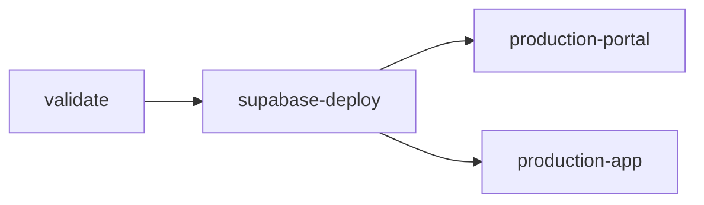
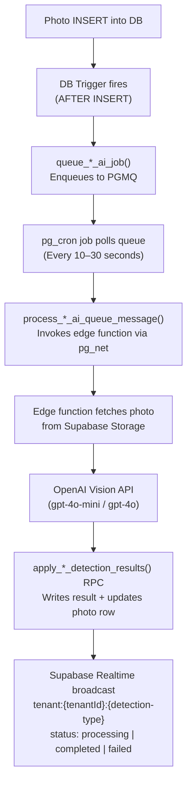

# CLAUDE.md — Platform Engineering Reference

This file is the authoritative reference for AI agents (Claude Code and others) working on this repository. It covers local stack setup, migrations, E2E testing, and the AI analysis pipeline.

---

## 1. Local Stack Setup

### Prerequisites

| Tool | Version | Install |
|------|---------|---------|
| Docker Desktop | Latest | Running before `supabase start` |
| Node.js | 20+ | `nvm install 20` |
| pnpm | 9+ | `npm install -g pnpm@9` |
| Supabase CLI | Latest | `brew install supabase/tap/supabase` |

### Start the Full Stack

```bash
# 1. Install dependencies
pnpm install

# 2. Start Supabase (Postgres, Auth, Storage, Edge Runtime, Studio)
pnpm supabase:start

# 3. Reset DB: runs all migrations + loads seed data + creates auth users
pnpm supabase:reset

# 4. Run both apps
pnpm dev              # Portal + Mobile App simultaneously
pnpm portal           # Portal only — http://localhost:5174
pnpm app              # Mobile App only — http://localhost:5173
```

### Service URLs

| Service | URL | Purpose |
|---------|-----|---------|
| Portal | http://localhost:5174 | Admin portal |
| Mobile App | http://localhost:5173 | Mobile-first app |
| Supabase API | http://127.0.0.1:54321 | REST / Realtime / Auth |
| Studio | http://127.0.0.1:54323 | Database UI |
| Inbucket | http://127.0.0.1:54324 | Local email testing |

### Edge Functions

```bash
# Serve all functions locally with hot reload
pnpm supabase:functions

# Serve with Chrome DevTools debugger
pnpm supabase:functions:debug
# Then open chrome://inspect → Add 127.0.0.1:8083
```

Edge functions are served at: `http://127.0.0.1:54321/functions/v1/<function-name>`

### Stopping

```bash
pnpm supabase:stop
```

### Seed Users

All seed users have password `Test1234!`. Key users:

| Email | Role |
|-------|------|
| `admin@acme-corp.com` | System Admin |
| `manager@acme-corp.com` | Tenant Admin (Acme Corp) |
| `operator@acme-corp.com` | Operator |
| `admin@test-co.com` | Tenant Admin (Test Co) |

---

## 2. Migrations

### File Format

```
supabase/migrations/YYYYMMDDHHMMSS_<descriptive_name>.sql
```

Example: `20260301120000_add_order_notes.sql`

### Create a New Migration

```bash
pnpm supabase migration new <name>
# Creates: supabase/migrations/<timestamp>_<name>.sql
# Edit the file, then apply:
pnpm supabase:reset
```

### Apply Migrations Locally

```bash
# Full reset (drops DB, re-runs all migrations, loads seed)
pnpm supabase:reset

# Incremental apply only (no seed, no drop) — faster for schema validation
supabase migration up
```

### Rules

- **Never edit a migration that has already been applied.** Always write a new migration file.
- Use idempotent DDL: `CREATE TABLE IF NOT EXISTS`, `DROP TABLE IF EXISTS`, `ADD COLUMN IF NOT EXISTS`, etc.
- Each migration must have a unique timestamp. If you create two in the same second, increment the seconds.
- Migrations run in timestamp order. When resolving merge conflicts, rename your migration to a later timestamp.

### What Goes in a Migration vs. seed.sql

| Content | Location |
|---------|----------|
| Schema (tables, enums, functions, triggers, indexes, RLS policies) | Migration file |
| Static app config (roles, system lookup types, queue names) | `seed.sql` |
| Test/dev data (users, tenants, sample records) | `seed.sql` |
| Production config synced from remote | `seed.sql` (via `pnpm supabase:seed:refresh`) |

---

## 3. Baseline Procedure

The database uses a **single baseline migration** that consolidates all production schema. Over time, incremental migrations accumulate. When there are more than ~30 migrations, consider consolidating.

### When to Consolidate

- Migration count exceeds ~30 files
- CI reset time becomes slow
- Preparing for a major version release

### Step-by-Step Consolidation

```bash
# 1. Link to production (run once if not already linked)
supabase link --project-ref <SUPABASE_PROJECT_REF>

# 2. Dump the current production schema
supabase db dump --linked > supabase/migrations/$(date +%Y%m%d)000000_baseline.sql

# 3. Delete all old migration files, keeping only the new baseline
# IMPORTANT: Keep a backup of the old files until verified
rm supabase/migrations/20260131*.sql supabase/migrations/20260201*.sql  # etc.

# 4. For each deleted migration, mark it as applied in production
# (prevents Supabase from trying to re-apply them)
supabase migration repair --status applied 20260131000000
supabase migration repair --status applied 20260201100000
# ... repeat for each deleted migration timestamp

# 5. Test locally
pnpm supabase:reset

# 6. Verify the app works
pnpm dev
```

### Baseline File Naming Convention

```
YYYYMMDD000000_baseline.sql
```

The `000000` time ensures it sorts before any migrations created that day.

---

## 4. Applying Migrations in CI

### Deployment Order (Critical)

Supabase **must deploy before frontends**. The CI job graph enforces this:



### CI Commands (in `supabase-deploy` job)

```bash
# Link to the production project (no Docker required)
supabase link --project-ref $SUPABASE_PROJECT_REF

# Apply pending migrations
supabase db push

# Deploy all edge functions
supabase functions deploy
```

Required secret: `SUPABASE_ACCESS_TOKEN` (personal access token from supabase.com/dashboard/account/tokens)

### Preview Branches

Supabase's GitHub integration automatically creates isolated preview branches for each PR:

- Branch name: `pr-<number>` (matches the GitHub branch)
- Migrations: automatically applied from `supabase/migrations/`
- Seed data: automatically loaded from `supabase/seed.sql`
- Cleanup: deleted when the PR is closed

**You do not need to manually manage preview branches.** The GitHub integration handles creation and cleanup workflows handle deletion.

### Migration Idempotency for CI

All DDL in migrations must be safe to run on a database that already has the schema applied (for preview branches that were created before your migration). Use `IF NOT EXISTS` / `IF EXISTS` guards.

---

## 5. E2E Tests

### Infrastructure Overview

The `scripts/e2e-local.sh` script orchestrates the full test run:

1. Verify Docker is running
2. Start Supabase (if not already running)
3. `pnpm supabase:reset` — reset and seed the database
4. Start edge functions in background (`pnpm supabase:functions`)
5. Run Playwright tests
6. Kill edge functions on exit (via `trap`)

### Running Tests

```bash
# Full suite (Portal + Mobile App)
pnpm e2e:local

# App-specific
pnpm e2e:local:portal
pnpm e2e:local:app

# Visible browser (debugging)
pnpm e2e:local:headed

# Filter by test name
pnpm e2e:local -- --grep "orders"
pnpm e2e:local:portal -- --grep "audit-logs"

# Affected only (Nx detects changed apps)
pnpm e2e:local -- --affected
pnpm affected:e2e

# Quick run (if Supabase + edge functions already running)
pnpm e2e          # All
pnpm e2e:portal   # Portal only
pnpm e2e:app      # Mobile app only

# Run a single spec file directly
npx playwright test \
  --config apps/app/playwright.config.ts \
  apps/app/e2e/tests/workflow/complete-workflow.spec.ts \
  --reporter=list
```

Always use `--reporter=list` for readable output when debugging individual tests.

### Database-Side Testing (No Browser)

For testing migrations and seed data without running the full E2E suite:

```bash
# Validate migrations apply cleanly
pnpm supabase:reset

# Run Deno integration tests against live local edge functions
cd supabase/functions
deno test --allow-net tests/hello-world-test.ts
```

### Creating New E2E Tests

1. **One spec file per feature area.** Name: `apps/<app>/e2e/tests/<area>/<feature>.spec.ts`
2. **Use `test-utils.ts` helpers** for login, navigation, and common assertions — never duplicate setup logic.
3. **Work on one test at a time.** Start the dev server first. Run with `--reporter=list` for readable output.
4. **Portal tests are read-only.** Assert pre-seeded data in grids. Do not create data in portal tests.
5. **Mobile app tests create data via the UI.** Tests are self-contained; each creates its own data.
6. **If a page needs data, add it to `seed.sql`**, not in the test itself.

### Seed Data Conventions

- **Tenant ID**: Use a deterministic UUID pattern for seed IDs (e.g., `bbbbbbbb-0001-0000-0000-000000000001`)
- **UUID pattern for seed IDs**: `ffffffff-XXXX-0000-0000-00000000YYYY`
- All data must be tenant-scoped for RLS (multi-tenant) or user-scoped (single-tenant)
- Use `ON CONFLICT DO NOTHING` for idempotent seeding

---

## 6. AI Analysis Architecture

### How It Works (End-to-End)



### Queue Tables

Each AI detection type has:

| Table | Purpose |
|-------|---------|
| `pgmq.q_<type>_ai_queue` | Active message queue (PGMQ) |
| `<type>_ai_runs` | Audit log: every AI call (tokens, duration, model, result) |
| `<type>_ai_dlq` | Dead-letter queue: messages that failed after max retries |

### Dead Letter Queue Pattern

Messages that fail processing are moved to the DLQ after exhausting retries. The DLQ is a regular Postgres table (not a PGMQ queue) for human inspection and manual replay.

### Realtime Status Broadcasts

The portal subscribes to Supabase Realtime channels for live AI status updates:

```
Channel: tenant:{tenantId}:{detection-type}    # Multi-tenant
Channel: {detection-type}                       # Single-tenant
Events:  status = "processing" | "completed" | "failed"
```

### AI Configuration

AI behavior is driven by **configurable database tables**, not hardcoded logic:

| Table | Purpose |
|-------|---------|
| `detection_tags` | What to look for (per-tag definitions, confidence guidance) |
| `detection_rules` | Business rules mapping tag combinations to classifications |
| `app_config` | Global settings (enabled/disabled toggles, thresholds) |

### Adding a New AI Detector

Follow the `ai-detection-process` skill in `.github/skills/`. The checklist covers:

1. Database schema (photos table, AI runs table, DLQ table, PGMQ queue)
2. Database functions (queue job, apply results, cron worker)
3. Edge function (photo fetch → OpenAI Vision → apply results RPC)
4. Realtime channel subscription in the frontend
5. Tests

---

## 7. Code Quality Rules

These rules apply to ALL code changes — the agent must enforce them:

- **Fix all ESLint errors** on every file you touch. Run `pnpm lint` before finishing.
- **i18n is mandatory**: No hardcoded user-facing strings. Add keys to both `en/` and `es/` translation files in the same commit.
- **Tests alongside features**: Every new feature or bug fix needs a test.
- **Never deploy migrations** or run data-modifying SQL without explicit user confirmation.
- **RLS on every table**: When creating a new table, always add `ALTER TABLE ... ENABLE ROW LEVEL SECURITY` and write appropriate policies.
- **`verify_jwt = false` in config.toml** for any edge function called by another edge function (server-to-server). The calling function must pass both `apikey` and `Authorization` headers.

---

## 8. Key Scripts Reference

| Script | What It Does |
|--------|-------------|
| `pnpm dev` | Start portal + mobile app |
| `pnpm portal` | Start portal only |
| `pnpm app` | Start mobile app only |
| `pnpm build` | Build all projects |
| `pnpm test` | Run all unit tests |
| `pnpm lint` | Lint all projects |
| `pnpm supabase:start` | Start local Supabase stack |
| `pnpm supabase:stop` | Stop local Supabase stack |
| `pnpm supabase:reset` | Full DB reset + seed + auth |
| `pnpm supabase:functions` | Serve edge functions (hot reload) |
| `pnpm supabase:functions:debug` | Serve with Chrome DevTools |
| `pnpm supabase:seed:refresh` | Sync config data from production |
| `pnpm e2e:local` | Full E2E suite (starts infra, runs tests) |
| `pnpm e2e:local:portal` | Portal E2E only |
| `pnpm e2e:local:app` | Mobile app E2E only |
| `pnpm e2e:local:headed` | E2E with visible browser |
| `pnpm e2e` | E2E tests only (infra must already be running) |
| `pnpm affected:lint` | Lint only Nx-affected projects |
| `pnpm affected:test` | Test only Nx-affected projects |
| `pnpm affected:e2e` | E2E only Nx-affected apps |
| `pnpm graph` | Open Nx project dependency graph |
